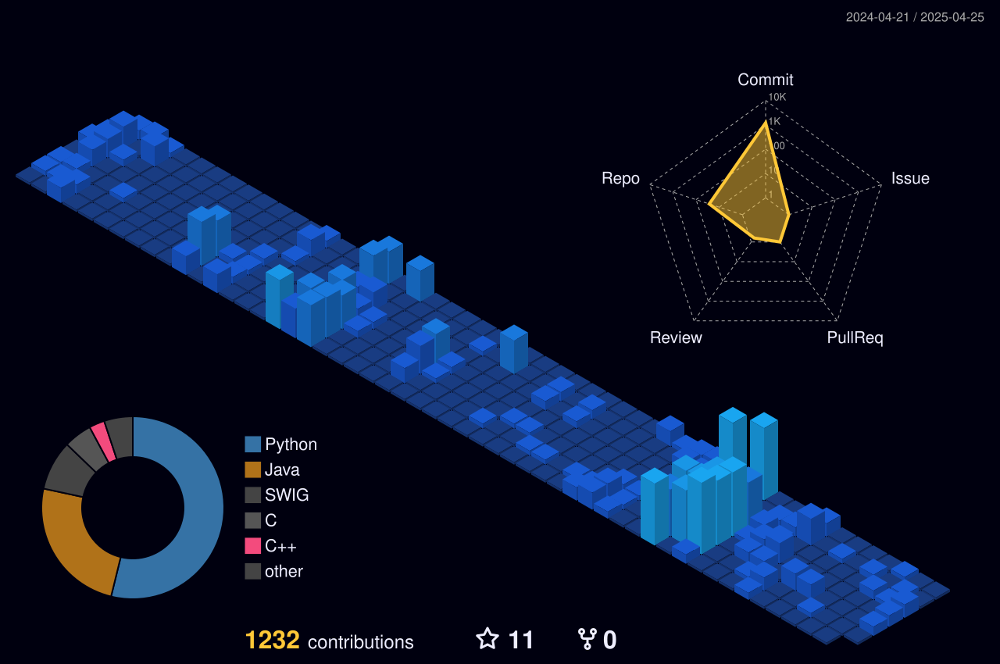

# 🚀 Welcome to My GitHub! | Stefano Paoloni  

Hi there! I'm **Stefano Paoloni**, a passionate **Computer Engineering Student** who loves **software development, algorithms, and problem-solving**. Here you'll find my projects, contributions, and insights into various programming languages and technologies.

---

## 🛠️ Technologies & Tools

### 🚀 Programming Languages:

### 🛠️ Developer Toolkit:

- **🖥️ IDEs**: Visual Studio Code, IntelliJ IDEA
- **💻 Operating Systems**: Linux, Windows, macOS
- **🔗 Version Control**: Git & GitHub

---

## 📊 GitHub Stats

  

---

## 🌟 Featured Projects

🚀 Here are some of my most exciting projects:

- **📌 [Telegram Quiz Bot](https://github.com/stefanopaolonii/telegram-quiz-bot)** - A Telegram bot that manages interactive quizzes.
- **📌 [ASE Project](https://github.com/stefanopaolonii/pacman)** - A project for ASE exam.
- **📌 [OOP Exam](https://github.com/stefanopaolonii/oop_v2)** - A project for my Object-Oriented Programming exam.

Check out my repositories for more interesting projects! 💡

---

## 📬 Get in Touch

💡 If you're interested in collaborating or just want to chat about tech, feel free to reach out:

- 🌐 **LinkedIn**: [Stefano Paoloni](https://www.linkedin.com/in/stefanopaoloni)
- 📧 **Email**: stefanopaoloni.work@gmail.com

---

### ⭐ Thank You for Visiting!

If you find my projects useful or inspiring, consider **starring ⭐ my repositories** or connecting with me on LinkedIn. Let's build something amazing together! 🚀

---
<!-- Stefano Paoloni GitHub, software projects, software development, programming, C, Python, Java, GitHub portfolio, Telegram bot, API REST, Computer Engineering Student -->

📅 **Last Updated:** *[2025/02/15]*
